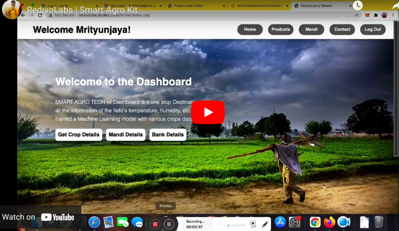

# Smart Agro Project 

-------------------
## About Project
Smart Agro Project is an IoT kit consists of several sensors that takes realtime readings from formers field and sends alerts over the text messages/email/calls to farmers when needed to act .

## Demo Video

